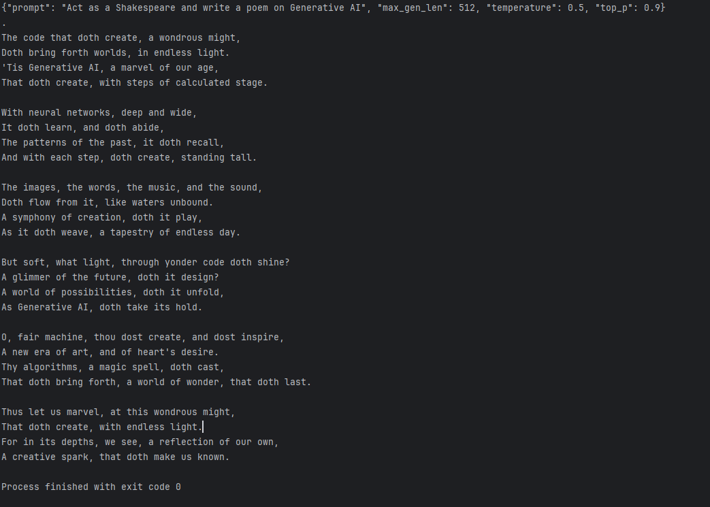

# PDF_RAG_Model_AWS_Chatbot

## In this particular video, we are going to learn an end-to-end LLM project using AWS Bedrock and LangChain. 

## Project Overview
This project implements a Document Q&A Chatbot that enables users to ask questions about PDF documents using 
state-of-the-art Retrieval-Augmented Generation (RAG). It leverages Amazon Bedrock, fully managed service offering 
multiple foundation models (FMs) like Claude, LLaMA 2, and Amazon Titan — with no infrastructure to manage.
    Topics: 
        
        Q) What Amazon Bedrock is
            Amazon Bedrock is a fully managed generative AI service by AWS that allows you to build and scale generative
            AI applications using foundation models (FMs) from leading AI companies (like Anthropic, Meta, Mistral, 
            Stability AI, Cohere, and Amazon) — without managing infrastructure. You can access these models via simple 
            API calls without needing to train or host them yourself. It supports text, image, embedding, chat, 
            and agent-based tasks. 
                
            Key Features:
                No model training or hosting needed.
                API-based access to multiple model providers.
                Use for text generation, embeddings, agents, image generation, etc.        

            
        Practical Use Cases Using Various Models            
            | Use Case                       | Model                               | Description                                                                                                                        |
            | ------------------------------ | ----------------------------------- | ---------------------------------------------------------------------------------------------------------------------------------- |
            | **Chatbot**                    | Claude (Anthropic) / Titan (Amazon) | Conversational agents that can handle customer service, HR queries, etc.                                                           |
            | **Content Summarization**      | Claude / Mistral                    | Summarize lengthy legal, financial, or academic documents.                                                                         |
            | **Text Generation**            | Meta’s LLaMA / Amazon Titan         | Create marketing copy, product descriptions, emails, or creative stories.                                                          |
            | **Image Generation**           | Stability AI                        | Create product images, art, or marketing visuals from text prompts.                                                                |
            | **Embedding for Search**       | Cohere Embed                        | Generate vector representations of text to power semantic search or recommendations.                                               |
            | **RAG-Based Search**           | Titan + Amazon Kendra or OpenSearch | Combine model generation with internal documents using retrieval augmented generation.                                             |
            | **Agents for Task Automation** | Bedrock Agents                      | Chain multiple API calls, functions, and reasoning steps to perform structured tasks (like booking, summarizing + emailing, etc.). |
            |________________________________|_____________________________________|____________________________________________________________________________________________________________________________________|

        Q) Why it matters
            _________________________________________________________________________________________________________________________________________________________
            | Reason                     | Description                                                                                                               |
            | -------------------------- | ------------------------------------------------------------------------------------------------------------------------- |
            | Multi-model Access         | Gives you flexibility to choose the best FM from multiple providers (e.g., Claude, Titan, LLaMA, etc.) for your use case. |
            | No Infrastructure Overhead | AWS handles all backend scaling, security, and updates. You just consume the model.                                       |
            | Easy Integration           | Native integration with AWS services (e.g., Lambda, SageMaker, API Gateway, S3, etc.).                                    |
            | Security & Compliance      | Runs inside your VPC, supports IAM, KMS encryption, audit logs via CloudTrail, etc.                                       |
            | Customization Support      | Supports fine-tuning (via Custom Models) and RAG (Retrieval Augmented Generation) with Agents.                            |
            |Supports RAG & Agents       | Easily build Retrieval-Augmented Generation applications and intelligent agents using Bedrock's built-in tools.
            |____________________________|___________________________________________________________________________________________________________________________|
        
        
            

We aim to:

    1. Use RAG (Retrieval-Augmented Generation) architecture.
    2. Store multiple PDFs as vector embeddings in a Vector Store.
    3. Retrieve answers from PDFs using LLMs from AWS Bedrock.

## Requirements & Setup
Libraries Required
    Install the following:

    1. boto3
    2. AWS CLI
    3. PyPDF
    4. LangChain
    5. Streamlit
    6. faiss-cpu

## Setup Steps

    Create a virtual environment.
    
    Run:
        pip install -r requirements.txt
        Configure AWS CLI.
    
    Q) How to code with it
            Step 1: Set up AWS SDK : Helps to connect to amazon services

                pip install boto3

## AWS SetUp
    1) Create a IAM User with administrative access 
        For the user create a CLI access key
        
        Verify the details with: 
            aws configure list

    Model Selected LLama3-3-70b-instruct -v1:0
    

    API Request
    {
         "modelId": "meta.llama3-3-70b-instruct-v1:0",
         "contentType": "application/json",
         "accept": "application/json",
         "body": "{\"prompt\":\"this is where you place your input text\",\"max_gen_len\":512,\"temperature\":0.5,\"top_p\":0.9}"
    }
    

    **TestingAPI:**

    import boto3
    import json
    
    bedrock_runtime = boto3.client(
        service_name='bedrock-runtime',
        region_name='us-east-2'  # Replace with your AWS region
    )
    
    model_id = 'meta.llama3-3-70b-instruct-v1:0' # Replace with the desired model
    prompt = "Act as a Shakespeare and write a poem on Generative AI"
    body = json.dumps({
        "prompt": prompt,
        "max_gen_len": 512,
        "temperature": 0.5,
        "top_p": 0.9
        # "parameters": {
        #   "temperature": 0.7,
        #   "top_p": 0.9,
        #   "max_gen_len": 256
        # }
    })
    
    print(body)
    response = bedrock_runtime.invoke_model(
        body=body,
        modelId=model_id,
        contentType='application/json',
        accept='application/json'
    )
    
    response_body = json.loads(response.get('body').read())
    print(response_body)
    
    Resault:
        
        
    Note : The API Request will change according to the model you have selected Please verify the API request in documentation along **with region 
    https://us-east-2.console.aws.amazon.com/bedrock/home?region=us-east-2#/model-catalog/serverless/meta.llama3-3-70b-instruct-v1:0**
    
    
    For claude the API Request is 
    
    {
      "modelId": "anthropic.claude-3-5-haiku-20241022-v1:0",
      "contentType": "application/json",
      "accept": "application/json",
      "body": {
        "anthropic_version": "bedrock-2023-05-31",
        "max_tokens": 200,
        "top_k": 250,
        "stopSequences": [],
        "temperature": 1,
        "top_p": 0.999,
        "messages": [
          {
            "role": "user",
            "content": [
              {
                "type": "text",
                "text": "hello world"
              }
            ]
          }
        ]
      }
    }

    API: 
    import boto3
    import json
    
    # Claude 3.5 Haiku model ID (use this exact string)
    Please get your model Id from Amazon>Bedrock>Cross-region inference>Slect your model >Inference profile ARN
    model_id = ""
    
    # Define your prompt
    prompt_text = "Can you write a python code to make a dataframe"
    
    # Claude message format (JSON body)
    payload = {
        "anthropic_version": "bedrock-2023-05-31",
        "max_tokens": 200,
        "top_k": 250,
        "stop_sequences": [],
        "temperature": 1,
        "top_p": 0.999,
        "messages": [
            {
                "role": "user",
                "content": [
                    {
                        "type": "text",
                        "text": prompt_text
                    }
                ]
            }
        ]
    }
    
    # Initialize the Bedrock Runtime client
    bedrock = boto3.client(service_name="bedrock-runtime", region_name="us-east-2")  # Adjust region if needed
    
    # Invoke the model
    response = bedrock.invoke_model(
        modelId=model_id,
        body=json.dumps(payload),
        contentType="application/json",
        accept="application/json"
    )
    
    # Parse and print the response
    response_body = json.loads(response['body'].read())
    response_text = response_body['content'][0]['text']
    print(response_text)

        

    We will build a RAG (Retrieval-Augmented Generation) based system:

        Multiple PDFs are embedded and stored in a Vector Store.
        
        Queries are answered by LLMs (via AWS Bedrock) using context fetched from those PDFs.
        
        Users can choose different LLMs: Claude, LLaMA 2, Titan.
    
    🔹 Demo Highlights
    
        User can enter a question like: "What are Transformers?"
        
        Output can be generated using Claude or LLaMA 2 API.
        
        Model retrieves context from PDFs and returns responses.

## Project Architecture
     Step 1: Data Injection

        Load PDFs from a folder.
        
        Split documents using RecursiveCharacterTextSplitter.
        
        Store chunks for embedding.
            
     Step 2: Create Vector Store
            
        Use Amazon Titan Embedding Model (or OpenAI, Google GenAI if desired).
        
        Embed document chunks.
        
        Store in FAISS (or ChromaDB).
            
     Step 3: Ask a Question
            
        Perform similarity search on vector store.
        
        Fetch matching chunks.
        
        Pass to LLM with prompt: "Summarize in 250 words..."
        
        Return final answer.
    

            User Uploads PDF
                    ↓
            Extract Text from PDF
                    ↓
            Chunk & Embed Text
                    ↓
            Store in Vector DB (e.g., FAISS, Pinecone)
                    ↓
            User Asks Question
                    ↓
            Retrieve Relevant Chunks
                    ↓
            Send Prompt + Chunks to Bedrock Model (Claude / LLaMA 2 / Titan)
                    ↓
            Return Answer to User
